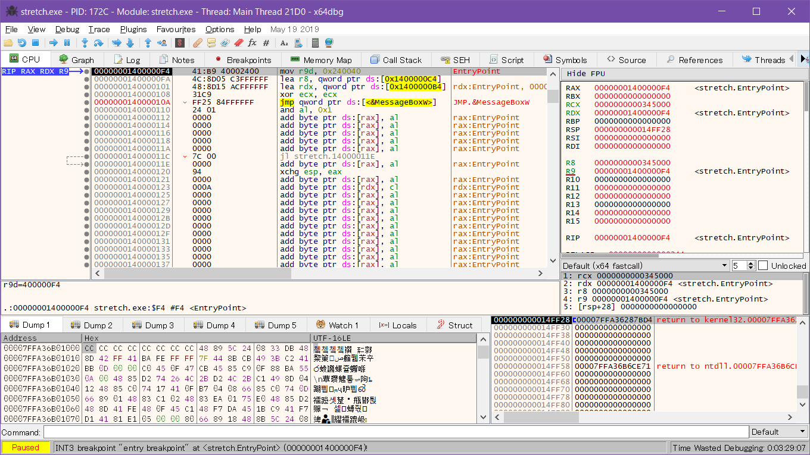

# 64 位 Windows 10 下的最小 PE 文件

[English Version - Minimal PE File on 64-Bit Windows 10](README-en.md)

## 实验内容

本次实验尝试制作 64 位 Windows 10 操作系统下的最小 PE 文件。

本次实验制作了 268 字节的 PE 文件，能够正常运行并弹出带有文字提示的消息框，且达到以下要求：

* 符号通过函数名（而不是函数序号）引入
* 消息框的标题和内容字符串的长度为 64 字节
* 总文件大小不超过 300 字节

本次实验的基本过程如下：

1. 使用 C 语言调用 Windows API，并使用 MSVC 编译器编译生成 PE 文件，实现弹出消息框的功能
1. 修改 MSVC 编译器的编译选项，减小生成的 PE 文件大小
1. 利用 [PE Tools](https://petoolse.github.io/petools/) 初步分析生成的 PE 文件，清除无用的 `TimeDateStamp` 字段、Rich header 和 debug directory
1. 利用二进制编辑器手动清除无用的 MS-DOS stub
1. 详细分析修改后的 PE 文件的各字段，然后使用汇编语言手动构造该 PE 文件，并使用伪指令替换硬编码的数值（例如使用 `$-$$` 替换文件大小）
1. 删除无用的 DOS stub、Rich header 和 debug table；对于 optional header 的 data directories 中的 16 项，仅保留前 2 项，并将 `NumberOfRvaAndSizes` 设置为 2；删除 `itbl` 后用于对齐的字节
1. 通过将各字段的值修改为其他值后，观察程序的行为是否受到影响，进一步得出文件中的无用字段，将有作用的字段与无用字段重叠
1. 将机器码较长的指令替换为短指令，然后用短跳转指令连接各条指令，分别与无用字段重叠
1. 删除文件末尾的 0

| 步骤 | 文件大小（字节） | 熵 |
| :- | :- | :- |
| 1 | 94208 | 5.924863 |
| 2 | 896 | 3.567715 |
| 3 | 896 | 2.220567 |
| 4 | 896 | 1.608427 |
| 5 | 896 | 1.607880 |
| 6 | 448 | 2.653766 |
| 7 | 308 | 2.473451 |
| 8 | 280 | 2.620173 |
| 9 | 268 | 2.667864 |

步骤 1 用 C 语言构造了一个普通的 PE 文件，便于与后续步骤生成的 PE 文件比较；步骤 2 使用编译选项缩小了步骤 1 的文件大小；在步骤 3-4 中，虽然文件的大小没有减小，但是文件的熵减小，说明文件有更多的 0，即文件大小有更多缩小的空间；从步骤 5 起，使用汇编语言手动构造了一个 PE 文件，并通过删除、重叠和拆分有效缩小了文件的大小。

## 实验环境

* 操作系统：Microsoft Windows 10 Version 1903 (v10.0.18362.239) 64-bit
* Shell：zsh 5.7.1 (x86_64-pc-msys)
* C 编译器：Microsoft (R) C/C++ Optimizing Compiler Version 19.22.27905 for x64
* 连接器：Microsoft (R) Incremental Linker Version 14.22.27905.0
* 汇编器：NASM version 2.14.02 compiled on Jan 30 2019
* 调试器：x64dbg May 19 2019, 18:13:13

## 实验步骤

### 步骤一

> 使用 C 语言调用 Windows API，并使用 MSVC 编译器编译生成 PE 文件，实现弹出消息框的功能

Windows API 中的 `MessageBoxW` 函数参考了 [MessageBoxW function](https://docs.microsoft.com/en-us/windows/desktop/api/winuser/nf-winuser-messageboxw)。

在 Windows 编程中，函数名以 A 结尾表示字符编码使用用户的当前代码页，以 W 结尾表示使用 UTF-16。由于目前用户使用的代码页并不统一，出于兼容性的考虑，使用 W 结尾的 `MessageBoxW` 函数。

将以下代码保存为 `tiny.c`：

```c
##include <Windows.h>

int main() {
    MessageBoxW( NULL /* hWnd */,
                 L"ABCDEFG" /* lpText, 16 bytes */,
                 L"💯 TinyPE on Windows 10" /* lpCaption, 48 bytes */,
                 MB_ICONASTERISK | MB_TOPMOST | MB_SERVICE_NOTIFICATION /* uType */ );
    return 0;
}
```

安装 Visual Studio Build Tools 2019 后，「开始」菜单中会出现 Visual Studio 2019 文件夹。点击其中的 x64 Native Tools Command Prompt for VS 2019 打开命令行，切换到当前目录后，输入以下命令：

```cmd
$ cl /O1 /source-charset:utf-8 tiny.c /link /SUBSYSTEM:WINDOWS /ENTRY:mainCRTStartup user32.lib
Microsoft (R) C/C++ Optimizing Compiler Version 19.22.27905 for x64
Copyright (C) Microsoft Corporation.  All rights reserved.

tiny.c
Microsoft (R) Incremental Linker Version 14.22.27905.0
Copyright (C) Microsoft Corporation.  All rights reserved.

/out:tiny.exe
/SUBSYSTEM:WINDOWS
/ENTRY:mainCRTStartup
user32.lib
tiny.obj
```

编译生成 `tiny.exe` 文件，可以正常运行：


**文件大小 94208 字节，熵 5.924863**

### 步骤二

> 修改 MSVC 编译器的编译选项，减小生成的 PE 文件大小

此步骤主要参考了 [Minimize the size of your program – high level](https://blogs.msdn.microsoft.com/xiangfan/2008/09/19/minimize-the-size-of-your-program-high-level/) 和 [Linker Options](https://docs.microsoft.com/en-us/cpp/build/reference/linker-options?view=vs-2019)。

将以下代码保存为 `tiny.c`：

```c
##include <Windows.h>

void _() {
    MessageBoxW( NULL /* hWnd */,
                 L"ABCDEFG" /* lpText, 16 bytes */,
                 L"💯 TinyPE on Windows 10" /* lpCaption, 48 bytes */,
                 MB_ICONASTERISK | MB_TOPMOST | MB_SERVICE_NOTIFICATION /* uType */ );
}
```

使用以下命令行选项编译：

```cmd
$ cl /O1 /MD /GS- /source-charset:utf-8 tiny.c /link /NOLOGO /NODEFAULTLIB /SUBSYSTEM:WINDOWS /ENTRY:_ /MERGE:.rdata=. /MERGE:.pdata=. /MERGE:.text=. /SECTION:.,ER /ALIGN:16 user32.lib
Microsoft (R) C/C++ Optimizing Compiler Version 19.22.27905 for x64
Copyright (C) Microsoft Corporation.  All rights reserved.

tiny.c
LINK : warning LNK4108: /ALIGN specified without /DRIVER; image may not run
LINK : warning LNK4254: section '.text' (60000020) merged into '.' (40000040) with different attributes
```

编译生成 `tiny.exe` 文件，可以正常运行。

**文件大小 896 字节，熵 3.567715**

### 步骤三

> 利用 [PE Tools](https://petoolse.github.io/petools/) 初步分析生成的 PE 文件，清除无用的 `TimeDateStamp` 字段、Rich header 和 debug directory

打开 PE Tools (v1.9.762.2018)，单击“PE Editor”，然后打开 `tiny.exe`。


* 点击“File Header”，找到“Time/Date”，设置为 0
* 点击“View Rich”，然后点击“Clear Sign”
* 点击“Directories”，找到“Debug Directory”，点击“...”，然后点击“Clear debug info”

修改后的 `tiny.exe` 文件可以正常运行。

**文件大小 896 字节，熵 2.220567**

### 步骤四

> 利用二进制编辑器手动删除无用的 MS-DOS stub

使用二进制编辑器打开  `tiny.exe`。

* 将 0x02-0x3b 设置为 0（0x00-0x01 为 `e_magic`，0x3c-0x3f 为 `e_lfanew`）
* 将 0x40-0x7f 设置为 0

修改后的 `tiny.exe` 文件可以正常运行，其内容应当如下：

```zsh
$ xxd -p tiny.exe
4d5a00000000000000000000000000000000000000000000000000000000
000000000000000000000000000000000000000000000000000000000000
c00000000000000000000000000000000000000000000000000000000000
000000000000000000000000000000000000000000000000000000000000
000000000000000000000000000000000000000000000000000000000000
000000000000000000000000000000000000000000000000000000000000
000000000000000000000000504500006486010000000000000000000000
0000f00022000b020e1690010000000000000000000000030000f0010000
000000400100000010000000100000000600000000000000060000000000
000080030000f00100000000000002006081000010000000000000100000
000000000000100000000000001000000000000000000000100000000000
000000000000200300002800000000000000000000000000000000000000
000000000000000000000000000000000000000000000000000000000000
000000000000000000000000000000000000000000000000000000000000
00000000f001000010000000000000000000000000000000000000000000
0000000000002e0000000000000082010000f001000090010000f0010000
000000000000000000000000200000605803000000000000000000000000
00003dd8afdc2000540069006e0079005000450020006f006e0020005700
69006e0064006f0077007300200031003000000041004200430044004500
460047000000000000000000000000000000000000000000000000000000
000000000000000000000000000000000000000000000000000000000000
000000000000000000000000000000000000000000000000000000000000
000000000000000000000000000000000000000000000000000000000000
000000000000000000000000000000000000000000000000000000000000
000000000000000000000000000000000000000000000000000000000000
00000000000000000000000000000000000041b9400024004c8d05f3feff
ff488d151cffffff33c948ff25d3feffffcccccc48030000000000000000
000066030000f00100000000000000000000000000000000000000000000
5803000000000000000000000000000094024d657373616765426f785700
5553455233322e646c6c00000000000000000000000000000000
```

可以使用 `xxd -p -r` 将以上文本转换回二进制文件。

**文件大小 896 字节，熵 1.608427**

### 步骤五

> 详细分析修改后的 PE 文件的各字段，然后使用汇编语言手动构造该 PE 文件，并使用伪指令替换硬编码的数值（例如使用 `$-$$` 替换文件大小）

PE 文件的结构主要参考了以下资料：

* 总述：[PE Format](https://docs.microsoft.com/en-us/windows/desktop/Debug/pe-format)，[x86 Disassembly/Windows Executable Files](https://en.wikibooks.org/wiki/X86_Disassembly/Windows_Executable_Files)，[Portable Executable File Format](https://blog.kowalczyk.info/articles/pefileformat.html)
* Rich header：[The Undocumented Microsoft "Rich" Header](http://bytepointer.com/articles/the_microsoft_rich_header.htm)
* Import address table：[Import table vs Import Address Table](https://reverseengineering.stackexchange.com/a/16872)

在理解 PE 文件的结构时，主要使用的工具有 [PE Tools](https://petoolse.github.io/petools/) 和 [PE Disassembler viewer](http://www.codedebug.com/php/Products/Products_NikPEViewer_20v.php)。

根据 NASM 汇编器的 [官方文档](https://www.nasm.us/doc/nasmdoc3.html#section-3.2.1)，分别使用伪指令 `db`、`dw`、`dd`、`dq` 声明 1、2、4、8 字节的数据。

使用伪指令替换硬编码的数值。例如，文件大小的数值为 0x0380，使用 `file_size equ $-$$` 替换；机器指令 0x41b940002400 使用 `mov r9d, 0x00240040` 替换。

编写的 `stretch.asm` 如下所示：

```assembly
BITS 64

%define align(n,r) (((n+(r-1))/r)*r)

; DOS Header
    dw 'MZ'                 ; e_magic
    dw 0                    ; [UNUSED] e_cblp
    dw 0                    ; [UNUSED] c_cp
    dw 0                    ; [UNUSED] e_crlc
    dw 0                    ; [UNUSED] e_cparhdr
    dw 0                    ; [UNUSED] e_minalloc
    dw 0                    ; [UNUSED] e_maxalloc
    dw 0                    ; [UNUSED] e_ss
    dw 0                    ; [UNUSED] e_sp
    dw 0                    ; [UNUSED] e_csum
    dw 0                    ; [UNUSED] e_ip
    dw 0                    ; [UNUSED] e_cs
    dw 0                    ; [UNUSED] e_lfarlc
    dw 0                    ; [UNUSED] e_ovno
    times 4 dw 0            ; [UNUSED] e_res
    dw 0                    ; [UNUSED] e_oemid
    dw 0                    ; [UNUSED] e_oeminfo
    times 10 dw 0           ; [UNUSED] e_res2
    dd pe_hdr               ; e_lfanew

; DOS Stub
    times 8 dq 0            ; [UNUSED] DOS Stub

; Rich Header
    times 8 dq 0            ; [UNUSED] Rich Header

; PE Header
pe_hdr:
    dw 'PE', 0              ; Signature

; Image File Header
    dw 0x8664               ; Machine
    dw 0x01                 ; NumberOfSections
    dd 0                    ; [UNUSED] TimeDateStamp
    dd 0                    ; PointerToSymbolTable
    dd 0                    ; NumberOfSymbols
    dw opt_hdr_size         ; SizeOfOptionalHeader
    dw 0x22                 ; Characteristics

; Optional Header, COFF Standard Fields
opt_hdr:
    dw 0x020b               ; Magic (PE32+)
    db 0x0e                 ; MajorLinkerVersion
    db 0x16                 ; MinorLinkerVersion
    dd code_size            ; SizeOfCode
    dd 0                    ; SizeOfInitializedData
    dd 0                    ; SizeOfUninitializedData
    dd entry                ; AddressOfEntryPoint
    dd iatbl                ; BaseOfCode

; Optional Header, NT Additional Fields
    dq 0x000140000000       ; ImageBase
    dd 0x10                 ; SectionAlignment
    dd 0x10                 ; FileAlignment
    dw 0x06                 ; MajorOperatingSystemVersion
    dw 0                    ; MinorOperatingSystemVersion
    dw 0                    ; MajorImageVersion
    dw 0                    ; MinorImageVersion
    dw 0x06                 ; MajorSubsystemVersion
    dw 0                    ; MinorSubsystemVersion
    dd 0                    ; Reserved1
    dd file_size            ; SizeOfImage
    dd hdr_size             ; SizeOfHeaders
    dd 0                    ; CheckSum
    dw 0x02                 ; Subsystem (Windows GUI)
    dw 0x8160               ; DllCharacteristics
    dq 0x100000             ; SizeOfStackReserve
    dq 0x1000               ; SizeOfStackCommit
    dq 0x100000             ; SizeOfHeapReserve
    dq 0x1000               ; SizeOfHeapCommit
    dd 0                    ; LoaderFlags
    dd 0x10                 ; NumberOfRvaAndSizes

; Optional Header, Data Directories
    dd 0                    ; Export, RVA
    dd 0                    ; Export, Size
    dd itbl                 ; Import, RVA
    dd itbl_size            ; Import, Size
    dd 0                    ; Resource, RVA
    dd 0                    ; Resource, Size
    dd 0                    ; Exception, RVA
    dd 0                    ; Exception, Size
    dd 0                    ; Certificate, RVA
    dd 0                    ; Certificate, Size
    dd 0                    ; Base Relocation, RVA
    dd 0                    ; Base Relocation, Size
    dd 0                    ; Debug, RVA
    dd 0                    ; Debug, Size
    dd 0                    ; Architecture, RVA
    dd 0                    ; Architecture, Size
    dd 0                    ; Global Ptr, RVA
    dd 0                    ; Global Ptr, Size
    dd 0                    ; TLS, RVA
    dd 0                    ; TLS, Size
    dd 0                    ; Load Config, RVA
    dd 0                    ; Load Config, Size
    dd 0                    ; Bound Import, RVA
    dd 0                    ; Bound Import, Size
    dd iatbl                ; IAT, RVA
    dd iatbl_size           ; IAT, Size
    dd 0                    ; Delay Import Descriptor, RVA
    dd 0                    ; Delay Import Descriptor, Size
    dd 0                    ; CLR Runtime Header, RVA
    dd 0                    ; CLR Runtime Header, Size
    dd 0                    ; Reserved, RVA
    dd 0                    ; Reserved, Size

opt_hdr_size equ $-opt_hdr

; Section Table
    section_name db '.'     ; Name
    times 8-($-section_name) db 0
    dd sect_size            ; VirtualSize
    dd iatbl                ; VirtualAddress
    dd code_size            ; SizeOfRawData
    dd iatbl                ; PointerToRawData
    dd 0                    ; PointerToRelocations
    dd 0                    ; PointerToLinenumbers
    dw 0                    ; NumberOfRelocations
    dw 0                    ; NumberOfLinenumbers
    dd 0x60000020           ; Characteristics

hdr_size equ $-$$

code:
; Import Address Directory
iatbl:
    dq symbol
    dq 0

iatbl_size equ $-iatbl

; Strings
title:
    db 0x3d,0xd8,0xaf,0xdc,0x20,0x00,0x54,0x00
    db 0x69,0x00,0x6e,0x00,0x79,0x00,0x50,0x00
    db 0x45,0x00,0x20,0x00,0x6f,0x00,0x6e,0x00
    db 0x20,0x00,0x57,0x00,0x69,0x00,0x6e,0x00
    db 0x64,0x00,0x6f,0x00,0x77,0x00,0x73,0x00
    db 0x20,0x00,0x31,0x00,0x30,0x00,0,0
content:
    db 0x41,0x00,0x42,0x00,0x43,0x00,0x44,0x00
    db 0x45,0x00,0x46,0x00,0x47,0x00,0,0

; Debug Table
    times 24 dq 0           ; [UNUSED] Debug Table

; Entry
entry:
    mov r9d, 0x00240040     ; uType
    lea r8, [rel title]     ; lpCaption
    lea rdx, [rel content]  ; lpText
    xor ecx, ecx            ; hWnd
    jmp [rel iatbl]         ; MessageBoxW

    times align($-$$,16)-($-$$) db 0xcc

; Import Directory
itbl:
    dq intbl                ; OriginalFirstThunk
    dd 0                    ; TimeDateStamp
    dd dll_name             ; ForwarderChain
    dd iatbl                ; Name
    dq 0                    ; FirstThunk

    times 3 dd 0

itbl_size equ $-itbl

; Import Name Table
intbl:
    dq symbol
    dq 0

; Symbol
symbol:
    dw 0x0294               ; [UNUSED] Function Order
    db 'MessageBoxW', 0     ; Function Name
dll_name:
    db 'USER32.dll', 0
    db 0

sect_size equ $-code

    times align($-$$,16)-($-$$) db 0

code_size equ $-code
file_size equ $-$$
```

编译：

```zsh
$ nasm -f bin -o stretch.exe -l stretch.lst stretch.asm
```

编译生成 `stretch.exe`，可以正常运行。

虽然 `stretch.exe` 是参照 `tiny.exe` 手动编写的，但是二者略有区别：

```zsh
$ diff =(xxd step4/tiny.exe) =(xxd step5/stretch.exe)
50c50
< 00000310: 1cff ffff 33c9 48ff 25d3 feff ffcc cccc  ....3.H.%.......
---
> 00000310: 1cff ffff 31c9 ff25 d4fe ffff cccc cccc  ....1..%........
```

`xor ecx, ecx` 指令在 `tiny.exe` 中由机器码 0x33c9 表示，而在 `stretch.exe` 中由 0x31c9 表示。由 [XOR — Logical Exclusive OR](https://www.felixcloutier.com/x86/xor) 可知，这是由于指令编码方式不同，不影响指令的效果：

```zsh
$ echo 33c9 | xxd -p -r - | ndisasm -b 64 -
00000000  33C9              xor ecx,ecx
$ echo 31c9 | xxd -p -r - | ndisasm -b 64 -
00000000  31C9              xor ecx,ecx
```

`jmp [rel iatbl]` 指令在 `tiny.exe` 中由机器码 0x48ff25d3feffff 表示，而在 `stretch.exe` 中由 0xff25d4feffff 表示。这两条指令的跳转地址没有差别：

```zsh
$ echo 48ff25d3feffff | xxd -p -r - | ndisasm -b 64 -
00000000  48FF25D3FEFFFF    jmp qword [rel 0xfffffffffffffeda]
$ echo ff25d4feffff | xxd -p -r - | ndisasm -b 64 -
00000000  FF25D4FEFFFF      jmp [rel 0xfffffffffffffeda]
```

由 Stack Overflow 上的 [一个回答](https://stackoverflow.com/a/36800114) 可知，机器码中的 48 前缀表示 REX.W，会被处理器忽略；这一前缀可能与 Windows x64 的 unwind data 有关。而且从运行结果看，这一修改不影响指令的效果。

**文件大小 896 字节，熵 1.607880**

### 步骤六

> 删除无用的 DOS stub、Rich header 和 debug table；对于 optional header 的 data directories 中的 16 项，仅保留前 2 项，并将 `NumberOfRvaAndSizes` 设置为 2；删除 `itbl` 后用于对齐的字节

将修改后的结果保存为 `stretch.asm`：

```zsh
$ diff step5/stretch.asm step6/stretch.asm
26,31d25
< ; DOS Stub
<     times 8 dq 0            ; [UNUSED] DOS Stub
< 
< ; Rich Header
<     times 8 dq 0            ; [UNUSED] Rich Header
< 
77c71
<     dd 0x10                 ; NumberOfRvaAndSizes
---
>     dd 0x02                 ; NumberOfRvaAndSizes
84,111d77
<     dd 0                    ; Resource, RVA
<     dd 0                    ; Resource, Size
<     dd 0                    ; Exception, RVA
<     dd 0                    ; Exception, Size
<     dd 0                    ; Certificate, RVA
<     dd 0                    ; Certificate, Size
<     dd 0                    ; Base Relocation, RVA
<     dd 0                    ; Base Relocation, Size
<     dd 0                    ; Debug, RVA
<     dd 0                    ; Debug, Size
<     dd 0                    ; Architecture, RVA
<     dd 0                    ; Architecture, Size
<     dd 0                    ; Global Ptr, RVA
<     dd 0                    ; Global Ptr, Size
<     dd 0                    ; TLS, RVA
<     dd 0                    ; TLS, Size
<     dd 0                    ; Load Config, RVA
<     dd 0                    ; Load Config, Size
<     dd 0                    ; Bound Import, RVA
<     dd 0                    ; Bound Import, Size
<     dd iatbl                ; IAT, RVA
<     dd iatbl_size           ; IAT, Size
<     dd 0                    ; Delay Import Descriptor, RVA
<     dd 0                    ; Delay Import Descriptor, Size
<     dd 0                    ; CLR Runtime Header, RVA
<     dd 0                    ; CLR Runtime Header, Size
<     dd 0                    ; Reserved, RVA
<     dd 0                    ; Reserved, Size
150,152d115
< ; Debug Table
<     times 24 dq 0           ; [UNUSED] Debug Table
< 
170,171d132
< 
<     times 3 dd 0
```

编译：

```zsh
$ nasm -f bin -o stretch.exe -l stretch.lst stretch.asm
```

编译生成 `stretch.exe`，可以正常运行。

**文件大小 448 字节，熵 2.653766**

### 步骤七

> 通过将各字段的值修改为其他值后，观察程序的行为是否受到影响，进一步得出文件中的无用字段，将有作用的字段与无用字段重叠

逐个修改 `stretch.asm` 中每个字段的值，例如修改为 0 或其他数据。如果修改后程序无法运行，或运行时发生异常，或显示的内容不正确，则认为该字段是有作用的字段；如果修改后程序仍能正常运行，则认为该字段是无用字段。

将有作用的字段无用字段与重叠，例如将 PE header 的起始位置设置为 DOS header 的 0x04 处，可以将两个文件头的字段重叠，缩小文件大小。

某些位置在两个文件头中均为无用字段，可以进一步将文件的后续部分与这些无用字段重叠。

重叠时可能存在多种方法，本次实验只选择其中一种方法。如果有作用的字段已经不能与剩余的无用字段重叠（例如有作用的字段占 16 字节，而无用字段只有 8 个字节），说明重叠完成。

另外，Import table 和 DLLFuncEntry 都是有用字段，但是两者可以重叠，这是因为 Import table 只在程序加载前使用，DLLFuncEntry 只在程序加载后使用。

重叠后的 `stretch.asm` 如下：

```assembly
BITS 64

                            ; DOS Header
    dw 'MZ'                 ; e_magic
    dw 0                    ; [UNUSED] e_cblp
pe_hdr:                                                 ; PE Header
    dw 'PE'                 ; [UNUSED] c_cp             ; Signature
    dw 0                    ; [UNUSED] e_crlc           ; Signature (Cont)
                                                        ; Image File Header
    dw 0x8664               ; [UNUSED] e_cparhdr        ; Machine
code:
symbol:                                                                                     ; Symbol
    dw 0x01                 ; [UNUSED] e_minalloc       ; NumberOfSections                  ; [UNUSED] Function Order
    db 'MessageBoxW', 0                                                                     ; Function Name
    times 14-($-symbol) db 0; [UNUSED] e_maxalloc       ; [UNUSED] TimeDateStamp
                            ; [UNUSED] e_ss             ; [UNUSED] TimeDateStamp (Cont)
                            ; [UNUSED] e_sp             ; [UNUSED] PointerToSymbolTable
                            ; [UNUSED] e_csum           ; [UNUSED] PointerToSymbolTable (Cont)
                            ; [UNUSED] e_ip             ; [UNUSED] NumberOfSymbols
                            ; [UNUSED] e_cs             ; [UNUSED] NumberOfSymbols (Cont)
    dw opt_hdr_size         ; [UNUSED] e_lfarlc         ; SizeOfOptionalHeader
    dw 0x22                 ; [UNUSED] e_ovno           ; Characteristics
opt_hdr:                                                ; Optional Header, COFF Standard Fields
    dw 0x020b               ; [UNUSED] e_res            ; Magic (PE32+)
    db 0                    ; [UNUSED] e_res (Cont)     ; [UNUSED] MajorLinkerVersion
    db 0                    ; [UNUSED] e_res (Cont)     ; [UNUSED] MinorLinkerVersion
    dd code_size            ; [UNUSED] e_res (Cont)     ; SizeOfCode
    dw 0                    ; [UNUSED] e_oemid          ; [UNUSED] SizeOfInitializedData
    dw 0                    ; [UNUSED] e_oeminfo        ; [UNUSED] SizeOfInitializedData (Cont)
    dd 0                    ; [UNUSED] e_res2           ; [UNUSED] SizeOfUninitializedData
    dd entry                ; [UNUSED] e_res2 (Cont)    ; AddressOfEntryPoint
    dd code                 ; [UNUSED] e_res2 (Cont)    ; BaseOfCode
                                                        ; Optional Header, NT Additional Fields
    dq 0x000140000000       ; [UNUSED] e_res2 (Cont)    ; ImageBase
    dd pe_hdr               ; e_lfanew                  ; [MODIFIED] SectionAlignment (0x10 -> 0x04)
    dd 0x04                                             ; [MODIFIED] FileAlignment (0x10)
    dw 0x06                                             ; [UNUSED] MajorOperatingSystemVersion
    dw 0                                                ; [UNUSED] MinorOperatingSystemVersion
    dw 0                                                ; [UNUSED] MajorImageVersion
    dw 0                                                ; [UNUSED] MinorImageVersion
    dw 0x06                                             ; MajorSubsystemVersion
    dw 0                                                ; MinorSubsystemVersion
    dd 0                                                ; [UNUSED] Reserved1
    dd file_size                                        ; SizeOfImage
    dd hdr_size                                         ; SizeOfHeaders
    dd 0                                                ; [UNUSED] CheckSum
    dw 0x02                                             ; Subsystem (Windows GUI)
    dw 0x8160                                           ; DllCharacteristics
    dq 0x100000                                         ; SizeOfStackReserve
    dq 0x1000                                           ; SizeOfStackCommit
    dq 0x100000                                         ; SizeOfHeapReserve
dll_name:                                                                                   ; DLLName
    db 'USER32.dll', 0                                                                      ; DLLName
    times 12-($-dll_name) db 0                          ; [UNUSED] SizeOfHeapCommit
                                                        ; [UNUSED] LoaderFlags
    dd 0x02                                             ; [MODIFIED] NumberOfRvaAndSizes (0x10)

; Optional Header, Data Directories
    dd 0                    ; [UNUSED] Export, RVA
    dd 0                    ; [UNUSED] Export, Size
iatbl:                                                  ; Import Address Directory
    dd itbl                 ; Import, RVA               ; [USEDAFTERLOAD] DLLFuncEntry
    dd itbl_size            ; Import, Size              ; [USEDAFTERLOAD] DLLFuncEntry (Cont)
iatbl_size equ $-iatbl

opt_hdr_size equ $-opt_hdr

                            ; Section Table
    section_name db '.', 0  ; Name
    times 8-($-section_name) db 0
    dd sect_size            ; VirtualSize
    dd iatbl                ; VirtualAddress
    dd code_size            ; SizeOfRawData
    dd iatbl                ; PointerToRawData
content:                                                ; Strings
    db 0x41,0x00,0x42,0x00,0x43,0x00,0x44,0x00
    db 0x45,0x00,0x46,0x00,0x47,0x00,0,0
                            ; [UNUSED] PointerToRelocations
                            ; [UNUSED] PointerToLinenumbers
                            ; [UNUSED] NumberOfRelocations
                            ; [UNUSED] NumberOfLinenumbers
                            ; [UNUSED] Characteristics
hdr_size equ $-$$

title:
    db 0x3d,0xd8,0xaf,0xdc,0x20,0x00,0x54,0x00
    db 0x69,0x00,0x6e,0x00,0x79,0x00,0x50,0x00
    db 0x45,0x00,0x20,0x00,0x6f,0x00,0x6e,0x00
    db 0x20,0x00,0x57,0x00,0x69,0x00,0x6e,0x00
    db 0x64,0x00,0x6f,0x00,0x77,0x00,0x73,0x00
    db 0x20,0x00,0x31,0x00,0x30,0x00,0,0

; Entry
entry:
    mov r9d, 0x00240040     ; uType
    lea r8, [rel title]     ; lpCaption
    lea rdx, [rel content]  ; lpText
    xor ecx, ecx            ; hWnd
    jmp [rel iatbl]         ; MessageBoxW

itbl:                       ; Import Directory
    dq intbl                ; OriginalFirstThunk
    dd 0                    ; [UNUSED] TimeDateStamp
    dd dll_name             ; ForwarderChain
    dd iatbl                ; Name
intbl:                                                  ; Import Name Table
    dq symbol               ; [UNUSED] FirstThunk       ; Symbol
    dq 0                                                ; nullptr
itbl_size equ $-itbl

sect_size equ $-code
code_size equ $-code
file_size equ $-$$
```

编译：

```zsh
$ nasm -f bin -o stretch.exe -l stretch.lst stretch.asm
```

编译生成 `stretch.exe`，可以正常运行。

**文件大小 308 字节，熵 2.473451**

### 步骤八

> 将机器码较长的指令替换为短指令，然后用短跳转指令连接各条指令，分别与无用字段重叠

在上一步骤中，文件的剩余部分已经不能继续重叠，因为最大的无用字段只有 8 个字节，而文件的剩余部分均大于 8 个字节。例如机器码占 28 字节：

```zsh
$ grep -A 5 entry: stretch.lst
    94                                  entry:
    95 000000F4 41B940002400                mov r9d, 0x00240040     ; uType
    96 000000FA 4C8D05C3FFFFFF              lea r8, [rel title]     ; lpCaption
    97 00000101 488D15ACFFFFFF              lea rdx, [rel content]  ; lpText
    98 00000108 31C9                        xor ecx, ecx            ; hWnd
    99 0000010A FF2584FFFFFF                jmp [rel iatbl]         ; MessageBoxW
```

其中，前四条指令用于函数调用的参数传递。根据 [x64 calling convention](https://docs.microsoft.com/en-us/cpp/build/x64-calling-convention?view=vs-2019)，在 Windows x64 中，函数的前四个参数分别使用 RCX、RDX、R8 和 R9 传递，只有当参数大于四个时才使用堆栈传递。`MessageBoxW` 的 `hWnd` 和 `uType` 两个参数的长度为 32 位而非 64 位，因此要将 RCX 替换为 ECX，R9 替换为 R9D。

第五条指令是跳转指令。为了减小 PE 文件的大小，不必处理 `MessageBoxW` 函数的返回值，直接使用 `jmp` 指令跳转到目标函数。

由 [JMP — Jump](https://www.felixcloutier.com/x86/jmp) 可知，短跳转指令的跳转范围为 –128 至 +127，机器码只占 2 个字节。因此，可以将每条指令作为单独的部分，再用短跳转指令连接各条指令。但是，两条 `lea` 指令的机器码仍占 9 个字节：

| 汇编指令 | 机器码长度 |
| :- | :- |
| `mov r9d, 0x00240040` then `jmp` | 8 |
| `lea r8, [rel title]` then `jmp` | 9 |
| `lea rdx, [rel content]` then `jmp` | 9 |
| `xor ecx, ecx` then `jmp` | 4 |
| `jmp [rel iatbl]` | 6 |

在 [x64dbg](https://x64dbg.com/) 中调试时发现，当程序执行到用户代码的入口点时，RDX 寄存器的值会被设置为入口地址：



通过修改汇编可以发现，在 `lea` 指令中，如果将 RDX 寄存器作为基址，生成的机器码更短：

| 汇编指令 | 机器码 | 长度 |
| :- | :- | :- |
| `lea r8, [rip-0x4d]` | 0x4c8d05b3ffffff | 7 |
| `lea r8, [rdx-0x4d]` | 0x4c8d42b3 | 4 |
| `lea rdx, [rip-0x44]` | 0x488d15bcffffff | 7 |
| `lea rdx, [rdx-0x44]` | 0x488d52bc | 4 |

因此，可以利用程序的这一行为缩短 `lea` 指令。修改后的汇编指令如下：

| 汇编指令 | 机器码长度 |
| :- | :- |
| `mov r9d, 0x00240040` then `jmp` | 8 |
| `lea r8, [rdx+title-entry]` then `jmp` | 6 |
| `lea rdx, [rdx+content-entry]` then `jmp` | 6 |
| `xor ecx, ecx` then `jmp` | 4 |
| `jmp [rel iatbl]` | 6 |

这样就可以与无用字段重叠。

将修改后的结果保存为 `stretch.asm`：

```assembly
BITS 64

                            ; DOS Header
    dw 'MZ'                 ; e_magic
    dw 0                    ; [UNUSED] e_cblp
pe_hdr:                                                 ; PE Header
    dw 'PE'                 ; [UNUSED] c_cp             ; Signature
    dw 0                    ; [UNUSED] e_crlc           ; Signature (Cont)
                                                        ; Image File Header
    dw 0x8664               ; [UNUSED] e_cparhdr        ; Machine
code:
symbol:                                                                                     ; Symbol
    dw 0x01                 ; [UNUSED] e_minalloc       ; NumberOfSections                  ; [UNUSED] Function Order
    db 'MessageBoxW', 0                                                                     ; Function Name
    times 14-($-symbol) db 0; [UNUSED] e_maxalloc       ; [UNUSED] TimeDateStamp
                            ; [UNUSED] e_ss             ; [UNUSED] TimeDateStamp (Cont)
                            ; [UNUSED] e_sp             ; [UNUSED] PointerToSymbolTable
                            ; [UNUSED] e_csum           ; [UNUSED] PointerToSymbolTable (Cont)
                            ; [UNUSED] e_ip             ; [UNUSED] NumberOfSymbols
                            ; [UNUSED] e_cs             ; [UNUSED] NumberOfSymbols (Cont)
    dw opt_hdr_size         ; [UNUSED] e_lfarlc         ; SizeOfOptionalHeader
    dw 0x22                 ; [UNUSED] e_ovno           ; Characteristics
opt_hdr:                                                ; Optional Header, COFF Standard Fields
    dw 0x020b               ; [UNUSED] e_res            ; Magic (PE32+)
    db 0                    ; [UNUSED] e_res (Cont)     ; [UNUSED] MajorLinkerVersion
    db 0                    ; [UNUSED] e_res (Cont)     ; [UNUSED] MinorLinkerVersion
    dd code_size            ; [UNUSED] e_res (Cont)     ; SizeOfCode
code_4:                                                                                     ; Code Fragment 4
    jmp [rel iatbl]                                                                         ; MessageBoxW
    times 8-($-code_4) db 0 ; [UNUSED] e_oemid          ; [UNUSED] SizeOfInitializedData
                            ; [UNUSED] e_oeminfo        ; [UNUSED] SizeOfInitializedData (Cont)
                            ; [UNUSED] e_res2           ; [UNUSED] SizeOfUninitializedData
    dd entry                ; [UNUSED] e_res2 (Cont)    ; AddressOfEntryPoint
    dd code                 ; [UNUSED] e_res2 (Cont)    ; BaseOfCode
                                                        ; Optional Header, NT Additional Fields
    dq 0x000140000000       ; [UNUSED] e_res2 (Cont)    ; ImageBase
    dd pe_hdr               ; e_lfanew                  ; [MODIFIED] SectionAlignment (0x10 -> 0x04)
    dd 0x04                                             ; [MODIFIED] FileAlignment (0x10)
code_3:                                                                                     ; Code Fragment 3
    lea rdx, [rdx+content-entry]                                                            ; lpText
    jmp code_4
    times 8-($-code_3) db 0                             ; [UNUSED] MajorOperatingSystemVersion
                                                        ; [UNUSED] MinorOperatingSystemVersion
                                                        ; [UNUSED] MajorImageVersion
                                                        ; [UNUSED] MinorImageVersion
    dw 0x06                                             ; MajorSubsystemVersion
    dw 0                                                ; MinorSubsystemVersion
    dd 0                                                ; [UNUSED] Reserved1
    dd file_size                                        ; SizeOfImage
    dd hdr_size                                         ; SizeOfHeaders
    dd 0                                                ; [UNUSED] CheckSum
    dw 0x02                                             ; Subsystem (Windows GUI)
    dw 0x8160                                           ; DllCharacteristics
    dq 0x100000                                         ; SizeOfStackReserve
    dq 0x1000                                           ; SizeOfStackCommit
    dq 0x100000                                         ; SizeOfHeapReserve
dll_name:                                                                                   ; DLLName
    db 'USER32.dll', 0                                                                      ; DLLName
    times 12-($-dll_name) db 0                          ; [UNUSED] SizeOfHeapCommit
                                                        ; [UNUSED] LoaderFlags
    dd 0x02                                             ; [MODIFIED] NumberOfRvaAndSizes (0x10)

                            ; Optional Header, Data Directories
code_2:                                                 ; Code Fragment 2
    mov r9d, 0x00240040                                 ; uType
    jmp code_3
    times 8-($-code_2) db 0 ; [UNUSED] Export, RVA
                            ; [UNUSED] Export, Size
iatbl:                                                  ; Import Address Directory
    dd itbl                 ; Import, RVA               ; [USEDAFTERLOAD] DLLFuncEntry
    dd itbl_size            ; Import, Size              ; [USEDAFTERLOAD] DLLFuncEntry (Cont)
iatbl_size equ $-iatbl

opt_hdr_size equ $-opt_hdr

                            ; Section Table
    section_name db '.', 0  ; Name
code_1:                                                 ; Code Fragment 1
    lea r8, [rdx+title-entry]                           ; lpCaption
    jmp code_2
    times 8-($-section_name) db 0
    dd sect_size            ; VirtualSize
    dd iatbl                ; VirtualAddress
    dd code_size            ; SizeOfRawData
    dd iatbl                ; PointerToRawData
content:                                                ; Strings
    db 0x41,0x00,0x42,0x00,0x43,0x00,0x44,0x00
    db 0x45,0x00,0x46,0x00,0x47,0x00,0,0
                            ; [UNUSED] PointerToRelocations
                            ; [UNUSED] PointerToLinenumbers
                            ; [UNUSED] NumberOfRelocations
                            ; [UNUSED] NumberOfLinenumbers
                            ; [UNUSED] Characteristics
hdr_size equ $-$$

title:
    db 0x3d,0xd8,0xaf,0xdc,0x20,0x00,0x54,0x00
    db 0x69,0x00,0x6e,0x00,0x79,0x00,0x50,0x00
    db 0x45,0x00,0x20,0x00,0x6f,0x00,0x6e,0x00
    db 0x20,0x00,0x57,0x00,0x69,0x00,0x6e,0x00
    db 0x64,0x00,0x6f,0x00,0x77,0x00,0x73,0x00
    db 0x20,0x00,0x31,0x00,0x30,0x00,0,0

itbl:                       ; Import Directory
    dq intbl                ; OriginalFirstThunk
entry:                                                  ; Code Fragment 0
    xor ecx, ecx                                        ; hWnd
    jmp code_1
    times 4-($-entry) db 0  ; [UNUSED] TimeDateStamp
    dd dll_name             ; ForwarderChain
    dd iatbl                ; Name
intbl:                                                  ; Import Name Table
    dq symbol               ; [UNUSED] FirstThunk       ; Symbol
itbl_size equ $-itbl
    dq 0                                                ; nullptr

sect_size equ $-code
code_size equ $-code
file_size equ $-$$
```

编译：

```zsh
$ nasm -f bin -o stretch.exe -l stretch.lst stretch.asm
```

编译生成 `stretch.exe`，可以正常运行。

**文件大小 280 字节，熵 2.620173**

### 步骤九

> 删除文件末尾的 0

程序加载时会在末尾自动填充 0，因此文件末尾的 0 可以删去。

将修改后的结果保存为 `stretch.asm`：

```zsh
$ diff step8/stretch.asm step9/stretch.asm
113c113
<     dq symbol               ; [UNUSED] FirstThunk       ; Symbol
---
>     dd symbol
115d114
<     dq 0                                                ; nullptr
```

编译：

```zsh
$ nasm -f bin -o stretch.exe -l stretch.lst stretch.asm
```

编译生成 `stretch.exe`，可以正常运行。

```zsh
$ xxd stretch.exe
00000000: 4d5a 0000 5045 0000 6486 0100 4d65 7373  MZ..PE..d...Mess
00000010: 6167 6542 6f78 5700 8000 2200 0b02 0000  ageBoxW...".....
00000020: 0201 0000 ff25 6a00 0000 0000 fc00 0000  .....%j.........
00000030: 0a00 0000 0000 0040 0100 0000 0400 0000  .......@........
00000040: 0400 0000 488d 52b8 ebda 0000 0600 0000  ....H.R.........
00000050: 0000 0000 0c01 0000 c400 0000 0000 0000  ................
00000060: 0200 6081 0000 1000 0000 0000 0010 0000  ..`.............
00000070: 0000 0000 0000 1000 0000 0000 5553 4552  ............USER
00000080: 3332 2e64 6c6c 0000 0200 0000 41b9 4000  32.dll......A.@.
00000090: 2400 ebb0 f400 0000 1800 0000 2e00 4c8d  $.............L.
000000a0: 42c8 ebe8 0201 0000 9400 0000 0201 0000  B...............
000000b0: 9400 0000 4100 4200 4300 4400 4500 4600  ....A.B.C.D.E.F.
000000c0: 4700 0000 3dd8 afdc 2000 5400 6900 6e00  G...=... .T.i.n.
000000d0: 7900 5000 4500 2000 6f00 6e00 2000 5700  y.P.E. .o.n. .W.
000000e0: 6900 6e00 6400 6f00 7700 7300 2000 3100  i.n.d.o.w.s. .1.
000000f0: 3000 0000 0801 0000 0000 0000 31c9 eb9e  0...........1...
00000100: 7c00 0000 9400 0000 0a00 0000            |...........
```

**文件大小 268 字节，熵 2.667864**

## 参考资料

除文中已说明的参考资料外，本实验还参考了以下资料：

1. [Tiny PE](http://www.phreedom.org/research/tinype/)
1. [Writing ultra-small Windows executables](https://keyj.emphy.de/win32-pe/)
